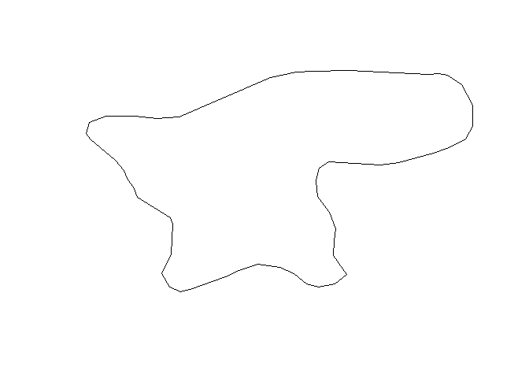
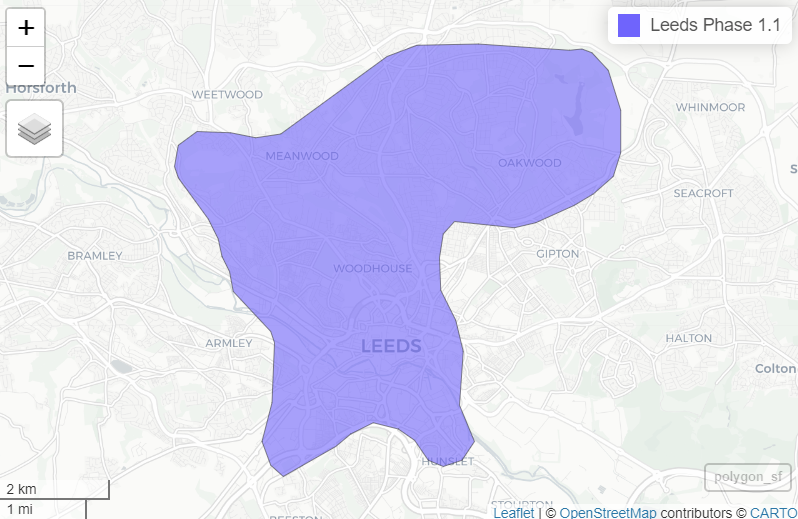

``` r
library(sf)
```

    Linking to GEOS 3.13.0, GDAL 3.10.1, PROJ 9.5.1; sf_use_s2() is TRUE

``` r
library(jsonlite)
leeds_geofence_url = "https://beryl-gbfs-production.web.app/v2_2/Leeds/geofencing_zones.json"  
leeds_geofence_parsed = jsonlite::fromJSON(leeds_geofence_url, flatten = TRUE)
leeds_geofence = leeds_geofence_parsed$data$geofencing_zones$features$geometry.coordinates[[1]]
class(leeds_geofence) # it's actually an array
```

    [1] "array"

``` r
# Convert to a matrix:
leeds_geofence_matrix = matrix(unlist(leeds_geofence), ncol = 2)
polygon = st_polygon(list(leeds_geofence_matrix))
plot(polygon)
```



``` r
geofence_sfc = st_sfc(polygon, crs = 4326)
geofence_df = data.frame(
  location = leeds_geofence_parsed$data$geofencing_zones$features$properties
)
polygon_sf = sf::st_sf(
  geofence_df,
  geometry = geofence_sfc
)
```

``` r
mapview::mapview(polygon_sf)
```


